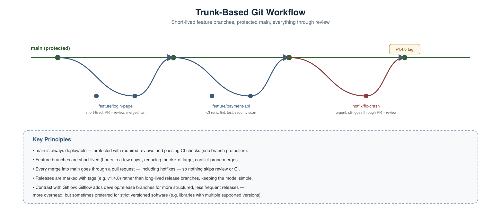
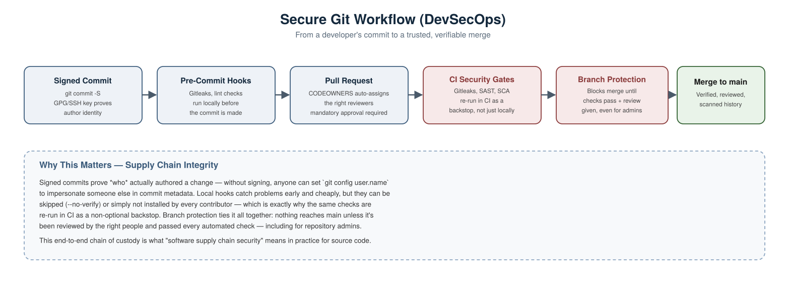

# Version Control (Git) Scenario-Based Interview Questions — DevOps & DevSecOps

A collection of real-world, scenario-style Git interview questions with detailed answers, covering both general DevOps workflow usage and DevSecOps-specific security concerns.

---

## 1. How would you structure branching for a team shipping multiple times a day?



**Scenario:** An interviewer asks you to describe a branching strategy suited to fast, frequent releases.

**Answer:** **Trunk-based development** with short-lived feature branches is the standard choice for high-velocity teams:
- `main` is always kept deployable, protected by required reviews and passing CI checks.
- Feature branches live for hours to a few days, not weeks — this keeps merges small and low-conflict.
- Every change, including urgent hotfixes, goes through a pull request — nothing skips review or CI, even under time pressure.
- Releases are marked with **tags** (e.g. `v1.4.0`) rather than long-lived release branches.

**Worth contrasting in an interview:** **Gitflow** (with `develop`, `release/*`, and `hotfix/*` branches) adds more structure and is sometimes preferred for software with multiple concurrently-supported versions (e.g. a library maintaining v1.x and v2.x simultaneously) — but it's heavier overhead than most fast-moving web/service teams need.

---

## 2. Two people modify the same lines of the same file on different branches. How do you resolve the conflict?

**Scenario:** You run `git merge feature-branch` and Git reports a conflict in `config.yaml`.

**Answer:**
Check which files are conflicted:
```bash
git status
```

Open the file — Git marks the conflicting sections directly:
```
<<<<<<< HEAD
timeout: 30
=======
timeout: 60
>>>>>>> feature-branch
```

Manually edit the file to the correct resolution, removing the conflict markers entirely, then mark it resolved:
```bash
git add config.yaml
```

Complete the merge:
```bash
git commit
```

**If you want to abandon the merge entirely instead:**
```bash
git merge --abort
```

**Interview tip:** mention that frequent, small commits and short-lived branches (see question 1) are the actual *prevention* strategy — conflicts get exponentially worse the longer two branches diverge.

---

## 3. A bad commit was deployed to production. Do you `revert` or `reset`? Why?

**Scenario:** A commit already merged to `main` and deployed introduced a bug.

**Answer:** Use `git revert`, not `git reset`, once something has been pushed and deployed:
```bash
git revert <commit-hash>
```
This creates a **new commit** that undoes the change, preserving history — safe for shared branches since it doesn't rewrite anything others may have already pulled.

`git reset` rewrites history by moving the branch pointer backward, which is fine for **local, unpushed** commits, but dangerous on a shared branch — anyone who already pulled the old commits ends up with a diverged, conflicting history, and force-pushing to fix it can silently erase others' work.

**Rule of thumb worth stating outright:** once it's pushed and others may have it, revert. Only reset what's still local and unshared.

---

## 4. When should you use `rebase` instead of `merge`, and what's the actual risk with rebase?

**Scenario:** A teammate insists on always rebasing feature branches onto `main` instead of merging.

**Answer:**
- **Rebase** rewrites your branch's commits on top of the latest `main`, producing a clean, linear history without merge commits — often preferred for tidy, readable history on feature branches before opening a PR:
```bash
git fetch origin
```
```bash
git rebase origin/main
```
- **Merge** preserves the actual history of how branches diverged and came back together, including a merge commit — safer, but a "noisier" history with many small branches.

**The real risk with rebase:** it rewrites commit hashes. **Never rebase a branch that others have already pulled and are working from** — doing so forces everyone else into a painful history mismatch. Rebase is safe for your own local, not-yet-shared feature branch; it's dangerous on any shared/public branch.

If you must update a branch you've already pushed after rebasing:
```bash
git push --force-with-lease
```
(`--force-with-lease` is safer than plain `--force` — it fails if someone else pushed changes you haven't seen yet, preventing accidentally overwriting their work.)

---

## 5. A secret was committed and pushed weeks ago. Deleting it in a new commit isn't enough — why, and what's the actual fix?

**Scenario:** You need to fully remove a leaked credential from Git history, not just from the current file state.

**Answer:** Simply deleting the file and committing again **does not remove it from history** — anyone can still retrieve the old version:
```bash
git show <old-commit-hash>:path/to/secret-file
```
The secret remains permanently recoverable from any clone of the repo unless the history itself is rewritten.

**Real fix — rewrite history to strip the file/secret entirely, using `git filter-repo`:**
```bash
git filter-repo --path path/to/secret-file --invert-paths
```

Force-push the rewritten history (coordinate with your team first — this changes every commit hash downstream):
```bash
git push origin --force --all
```

**Critical follow-up that's easy to forget:** rewriting history does **not** undo the exposure — the secret was already live in Git for however long it was there. **Rotate the credential immediately**, regardless of how thoroughly history is cleaned up.

---

## 6. You run a Git command and end up in a "detached HEAD" state. What does that mean, and how do you get back safely?

**Scenario:** You checked out a specific commit hash to inspect old code, and now `git status` says you're in a detached HEAD state.

**Answer:** This means `HEAD` is pointing directly at a commit instead of at a branch — any new commits you make here **aren't attached to any branch** and can be lost once you switch away, since nothing is tracking them.

**If you haven't made any changes**, just switch back safely:
```bash
git checkout main
```

**If you made commits you want to keep**, create a branch right where you are, before switching away:
```bash
git branch recovered-work
```
```bash
git checkout recovered-work
```

Now those commits are safely attached to a real branch and won't be garbage-collected.

---

## 7. A critical bug fix needs to go into both `main` and an older `release/2.3` branch. How do you do that without merging all of `main`'s other changes into the release branch?

**Scenario:** You fixed a bug on `main`, but a customer running the older `2.3` release also needs the fix, without pulling in unrelated newer changes.

**Answer:** Use `git cherry-pick` to apply just that one specific commit onto the other branch:
```bash
git checkout release/2.3
```
```bash
git cherry-pick <commit-hash-from-main>
```

This replays only that single commit's changes onto `release/2.3`, without bringing along everything else that's happened on `main` since the branches diverged.

**Note worth mentioning:** cherry-picking creates a **new commit with a new hash** on the target branch — it's a copy of the change, not a link back to the original commit, so the same fix will show up twice in history with different hashes.

---

## 8. A bug exists somewhere in the last 200 commits, but you don't know which one introduced it. How do you find it efficiently?

**Scenario:** A regression was introduced at some unknown point over the last few weeks of commits.

**Answer:** Use `git bisect`, which does a binary search across your commit history instead of checking commits one by one:
```bash
git bisect start
```
```bash
git bisect bad
```
(marks the current commit as containing the bug)
```bash
git bisect good <known-good-commit-hash>
```

Git checks out a commit roughly halfway between good and bad. Test it, then tell Git the result:
```bash
git bisect good
```
or
```bash
git bisect bad
```

Repeat until Git identifies the exact commit that introduced the regression, then stop:
```bash
git bisect reset
```

**Efficiency note:** this turns a linear search through 200 commits into roughly 8 steps (log₂ 200 ≈ 7.6) — a huge time saver on a large history.

---

## 9. How do you prove a commit actually came from who it claims to be from?



**Scenario:** A security review asks how you'd verify commit authenticity — since `git config user.name` can be set to anything, with no verification at all.

**Answer:** By default, Git commit authorship is just **metadata anyone can set** — it's not proof of identity. Use **commit signing** (GPG or SSH keys) to cryptographically prove a commit really came from the claimed author.

Configure a signing key:
```bash
git config --global user.signingkey <key-id>
```

Sign a commit:
```bash
git commit -S -m "Fix authentication bug"
```

Sign all commits automatically going forward:
```bash
git config --global commit.gpgsign true
```

On GitHub, a signed and verified commit shows a **"Verified"** badge. You can also require signed commits as part of branch protection, rejecting unsigned commits from ever being merged.

**Why this matters for DevSecOps:** this is a core piece of **software supply chain security** — it establishes a verifiable chain of custody for who actually introduced each change, which matters a great deal if a malicious or compromised commit ever needs to be traced back to its source.

---

## 10. Walk me through what a secure, production-grade Git workflow looks like end-to-end.

**Answer, referring to the diagram above:**
1. **Signed Commits** — developers sign commits (GPG/SSH) so authorship is cryptographically verifiable, not just self-reported metadata.
2. **Pre-Commit Hooks** — Gitleaks and linting run locally before a commit is even made, catching problems at the cheapest possible point.
3. **Pull Request + CODEOWNERS** — changes go through review, with the right reviewers auto-assigned based on which files changed.
4. **CI Security Gates** — the same secrets/SAST/SCA checks run again in CI, as a backstop for anyone who skipped or lacked the local hook.
5. **Branch Protection** — nothing merges to `main` without passing checks and required approvals, enforced even for repository admins.
6. **Merge to main** — only reviewed, scanned, verifiable code ends up in the trunk.

**Why this matters in an interview:** exactly like the Terraform/Ansible/Docker/Kubernetes answers — no single control is trusted alone. Local hooks can be bypassed (`--no-verify`); that's why the same checks reappear in CI. Reviews can be informal; that's why CODEOWNERS and required-approval counts formalize it. This layered structure is what turns "we use Git" into an actual secure software supply chain.

---

## Summary Table

| # | Scenario | Key Concept Tested |
|---|---|---|
| 1 | Structuring branches for frequent releases | Trunk-based development vs. Gitflow |
| 2 | Resolving a merge conflict | Conflict markers, `merge --abort` |
| 3 | Undoing a bad commit already in production | `revert` vs. `reset` |
| 4 | Choosing rebase vs. merge | Linear history, rewriting risk, `--force-with-lease` |
| 5 | Removing a secret from history | `git filter-repo`, credential rotation |
| 6 | Ending up in detached HEAD | HEAD vs. branch pointers, recovery |
| 7 | Applying one fix to two branches | `git cherry-pick` |
| 8 | Finding which commit introduced a bug | `git bisect` |
| 9 | Proving commit authorship | GPG/SSH commit signing |
| 10 | Full secure Git workflow design | Layered supply chain integrity |
