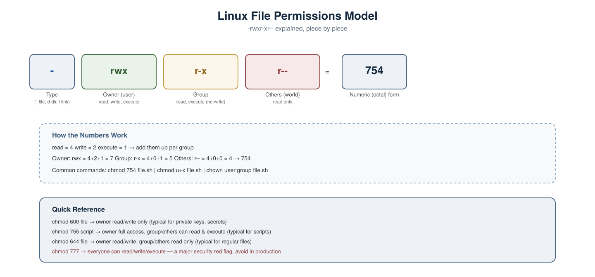
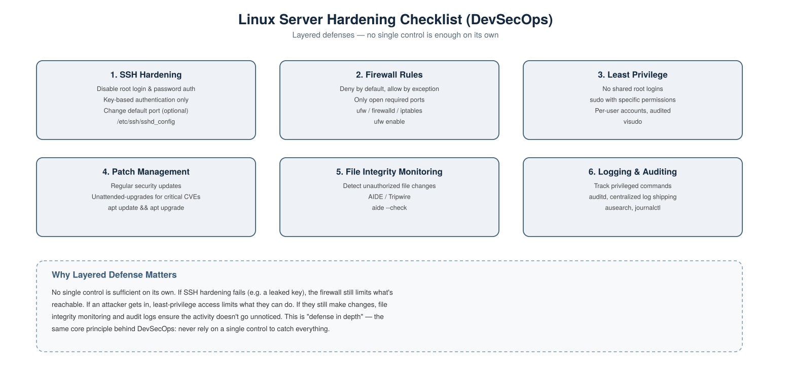

# Linux Scenario-Based Interview Questions — DevOps & DevSecOps

A collection of real-world, scenario-style Linux interview questions with detailed answers, covering both general DevOps administration and DevSecOps-specific security concerns.

---

## 1. A script won't run and you get "Permission denied." Walk me through diagnosing and fixing it.



**Scenario:** You upload `deploy.sh` to a server and run `./deploy.sh`, but get `Permission denied`.

**Answer:**
Check current permissions first:
```bash
ls -l deploy.sh
```
If the output looks like `-rw-r--r--`, the execute bit isn't set for anyone — that's the problem.

Add execute permission for the owner:
```bash
chmod u+x deploy.sh
```
Or set it explicitly using the numeric form (owner: read/write/execute, group/others: read/execute):
```bash
chmod 755 deploy.sh
```

**Follow-up an interviewer might ask:** "What if `ls -l` shows the execute bit is already set?" — then check whether the filesystem itself is mounted with `noexec` (common on `/tmp` in hardened systems):
```bash
mount | grep noexec
```

---

## 2. A junior engineer accidentally ran `chmod 777` on a sensitive config file. Why is this a problem, and how do you fix it?

**Scenario:** A file containing database connection details now has `777` permissions.

**Answer:** `777` means **every user on the system** — owner, group, and everyone else — can read, write, and execute the file. For a sensitive config file, this means:
- Any local user (or a compromised low-privilege process) can read secrets inside it.
- Any local user can modify it, potentially injecting malicious values.

**Fix — restore least-privilege permissions:**
```bash
chmod 600 config.yml
```
This restricts it to owner read/write only. Also confirm ownership is correct:
```bash
chown appuser:appgroup config.yml
```

**Prevention:** avoid `777` entirely as a habit — it's almost never the correct fix for a permissions error, and its use is a common flag in security audits and CIS benchmark scans.

---

## 3. A server is running out of disk space. How do you find out what's consuming it, live, in production?

**Scenario:** Monitoring alerts fire for 95% disk usage on a production server, and you need to find the cause quickly without taking anything down.

**Answer:**
Confirm which filesystem is actually full:
```bash
df -h
```

Find the largest directories, starting from root (or the affected mount):
```bash
du -sh /* 2>/dev/null | sort -rh | head -10
```

Drill down further into a specific heavy directory:
```bash
du -sh /var/log/* | sort -rh | head -10
```

A very common culprit — a log file that grew unbounded because log rotation wasn't configured:
```bash
ls -lhS /var/log | head -5
```

**Careful fix (don't just delete blindly):** if it's an actively-written log file held open by a running process, `rm` alone won't free the space until the process is restarted, because the file descriptor stays open. Instead, truncate it safely:
```bash
truncate -s 0 /var/log/big-app.log
```

**Prevention:** configure `logrotate` so this doesn't recur.

---

## 4. A process is consuming 100% CPU and the server is unresponsive. How do you investigate and safely resolve it?

**Scenario:** Users report the application is extremely slow. You SSH in and need to find and deal with the runaway process.

**Answer:**
Identify the top CPU consumers:
```bash
top
```
Or for a snapshot, sorted view:
```bash
ps aux --sort=-%cpu | head -10
```

Get more detail on a specific suspicious process ID:
```bash
ps -p <PID> -o pid,ppid,cmd,%cpu,%mem,etime
```

**Graceful stop first** (allows the process to clean up):
```bash
kill <PID>
```

**Force kill only if it doesn't respond** (skips cleanup — last resort):
```bash
kill -9 <PID>
```

**Security angle worth mentioning in an interview:** before killing it, it's worth briefly checking *what* the process actually is — an unexpected process consuming CPU (especially one not tied to a known service) can be a sign of cryptomining malware or a compromised host, not just a bug. Check its binary path and parent process:
```bash
ls -l /proc/<PID>/exe
```

---

## 5. How do you make sure a critical service automatically restarts if it crashes, and starts on boot?

**Scenario:** You're deploying a custom application as a systemd service and need it to be resilient.

**Answer:**
Create a systemd unit file:
```bash
sudo nano /etc/systemd/system/myapp.service
```

Example content:
```ini
[Unit]
Description=My Application
After=network.target

[Service]
ExecStart=/usr/local/bin/myapp
Restart=on-failure
RestartSec=5
User=appuser

[Install]
WantedBy=multi-user.target
```

Reload systemd to pick up the new unit file:
```bash
sudo systemctl daemon-reload
```

Enable it to start on boot:
```bash
sudo systemctl enable myapp
```

Start it now:
```bash
sudo systemctl start myapp
```

Check its status:
```bash
sudo systemctl status myapp
```

**Note the security detail worth mentioning:** `User=appuser` ensures the service doesn't run as root — least privilege applied even to how services are configured, not just human accounts.

---

## 6. How do you find who made a specific change on a server, and when?

**Scenario:** A configuration file changed unexpectedly, and you need to figure out who did it, since multiple people have SSH access.

**Answer:**
Check the system's authentication log for logins around the suspected time:
```bash
grep "sshd" /var/log/auth.log | tail -50
```
(On RHEL/CentOS systems, this is typically `/var/log/secure` instead.)

If `auditd` is configured (recommended for production), check for the specific file modification event:
```bash
sudo ausearch -f /etc/nginx/nginx.conf
```

Check command history for a specific user, if still in their shell history file:
```bash
cat /home/username/.bash_history
```
**Caveat to mention:** `.bash_history` is easily cleared or edited by the user themselves, so it's not a trustworthy audit source on its own — this is exactly why real environments rely on `auditd` (which logs at the kernel level and is much harder to tamper with) rather than shell history for accountability.

---

## 7. How do you restrict SSH access to key-based authentication only, and why does this matter?



**Scenario:** A security audit flags that your servers currently allow password-based SSH login.

**Answer:** Password authentication is vulnerable to brute-force attacks and credential stuffing; key-based authentication is dramatically more resistant since it requires possession of a private key, not just knowledge of a password.

Edit the SSH daemon config:
```bash
sudo nano /etc/ssh/sshd_config
```

Set these values:
```
PasswordAuthentication no
PermitRootLogin no
PubkeyAuthentication yes
```

Restart SSH to apply changes:
```bash
sudo systemctl restart sshd
```

**Important operational caution to mention in an interview:** always test key-based login in a **second terminal session** before closing your current one — if the config is wrong, you could lock yourself out of the server entirely with no way back in except console/out-of-band access.

---

## 8. How would you configure a firewall so only necessary ports are reachable?

**Scenario:** A new web server needs to allow SSH, HTTP, and HTTPS only — everything else should be blocked.

**Answer:** Using `ufw` (Ubuntu's simplified firewall front-end for iptables):

Set default policies — deny everything unless explicitly allowed:
```bash
sudo ufw default deny incoming
```
```bash
sudo ufw default allow outgoing
```

Allow only the required ports:
```bash
sudo ufw allow 22/tcp
```
```bash
sudo ufw allow 80/tcp
```
```bash
sudo ufw allow 443/tcp
```

Enable the firewall:
```bash
sudo ufw enable
```

Verify the active rules:
```bash
sudo ufw status verbose
```

**Interview tip:** mention the "deny by default, allow by exception" principle by name — it's the same underlying idea as least privilege, applied to network access instead of user permissions.

---

## 9. How would you detect if an attacker modified a system binary or config file without your knowledge?

**Scenario:** You suspect a server may have been compromised and want to check for unauthorized file changes.

**Answer:** Use a **file integrity monitoring** tool like AIDE (Advanced Intrusion Detection Environment), which takes a cryptographic snapshot of important files and later flags anything that's changed.

Install and initialize a baseline database:
```bash
sudo apt install aide
```
```bash
sudo aideinit
```

Run a check against the baseline at any point later:
```bash
sudo aide --check
```

Any file that's been added, removed, or modified since the baseline will be listed — including changes to file hashes, permissions, and ownership.

**Why this matters in DevSecOps:** this is the Linux-level equivalent of Terraform drift detection — it answers "does the current state match the expected, trusted state?" for the OS itself, not just your infrastructure code.

---

## 10. Walk me through how you'd harden a freshly provisioned Linux server before putting it into production.

**Answer, referring to the checklist diagram above:**
1. **SSH Hardening** — disable root login and password auth, key-based access only.
2. **Firewall Rules** — deny by default, only open the specific ports the service needs.
3. **Least Privilege** — no shared root accounts; individual named accounts with `sudo` scoped to only what's needed.
4. **Patch Management** — apply security updates regularly, ideally with automated critical-patch application.
5. **File Integrity Monitoring** — establish a baseline (AIDE/Tripwire) so unauthorized changes are detectable.
6. **Logging & Auditing** — enable `auditd` for privileged command tracking, and ship logs to a centralized system so they survive even if the local host is compromised.

**Why this matters in an interview:** this demonstrates "defense in depth" — no single control here is sufficient alone. If one layer is bypassed (e.g. a leaked SSH key), the others (firewall scope, least privilege, audit logging) limit the blast radius and make the activity detectable.

---

## Summary Table

| # | Scenario | Key Concept Tested |
|---|---|---|
| 1 | Script won't execute | File permissions, `chmod` |
| 2 | `chmod 777` on a config file | Least privilege, permission risk |
| 3 | Disk space full | `df`, `du`, log growth, safe truncation |
| 4 | Process at 100% CPU | `top`/`ps`, graceful vs. force kill, malware awareness |
| 5 | Service must auto-restart | systemd unit files, `Restart=on-failure` |
| 6 | Finding who made a change | `auth.log`, `auditd`, limits of shell history |
| 7 | Disabling SSH password auth | Key-based auth, safe rollout practice |
| 8 | Restricting open ports | Firewall, deny-by-default |
| 9 | Detecting unauthorized file changes | File integrity monitoring (AIDE) |
| 10 | Hardening a new server end-to-end | Defense in depth |
