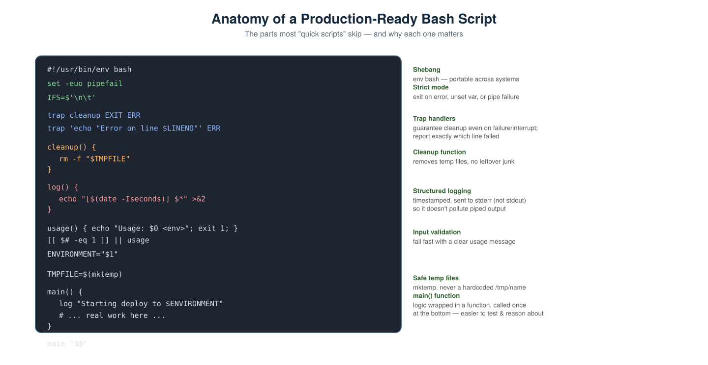
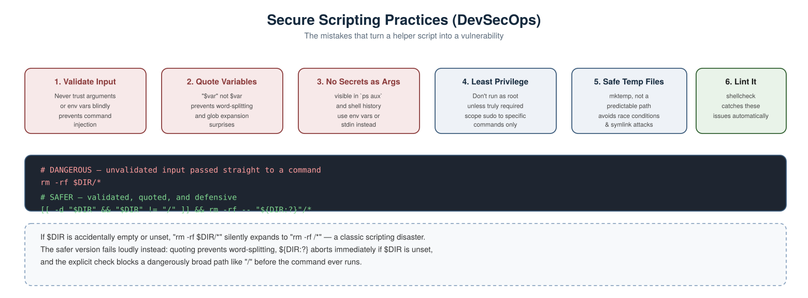

# Scripting Scenario-Based Interview Questions — DevOps & DevSecOps

A collection of real-world, scenario-style scripting interview questions with detailed answers, covering both general Bash/Python DevOps automation and DevSecOps-specific security concerns.

---

## 1. A script "worked on my machine" but silently did the wrong thing in CI. What's likely missing?



**Scenario:** A deploy script ran without any visible error, but skipped a critical step because an earlier command in the middle actually failed.

**Answer:** By default, Bash **keeps executing subsequent commands even if one fails** — a script without safeguards can silently continue after a real error. The fix is **strict mode**, placed at the very top of every script:

```bash
set -euo pipefail
```

- `-e` — exit immediately if any command fails.
- `-u` — treat use of an unset variable as an error (catches typos like `$DIRR` instead of `$DIR`).
- `-o pipefail` — a pipeline (`cmd1 | cmd2`) fails if *any* stage fails, not just the last one (without this, `false | true` reports success).

**Also worth adding:** a trap to catch failures with context:
```bash
trap 'echo "Error on line $LINENO"' ERR
```

---

## 2. Your deploy script leaves temp files behind every time it fails partway through. How do you fix this properly?

**Scenario:** A script creates a temporary working file, but if it exits early due to an error, the temp file is never cleaned up.

**Answer:** Use a **trap on EXIT** (not just on success) to guarantee cleanup runs no matter how the script ends — success, failure, or interruption (Ctrl+C):

```bash
TMPFILE=$(mktemp)

cleanup() {
  rm -f "$TMPFILE"
}
trap cleanup EXIT
```

Because the trap is registered on `EXIT`, it runs regardless of *why* the script is exiting — a normal finish, an error under `set -e`, or a Ctrl+C — so there's no code path where the temp file survives.

**Security note worth mentioning:** always create temp files with `mktemp`, never a hardcoded predictable name like `/tmp/myscript.tmp` — a predictable path is vulnerable to symlink attacks and race conditions where another process (potentially malicious) creates the file first.

---

## 3. A script passes a database password as a command-line argument. Why is this a security problem?

**Scenario:**
```bash
./backup.sh --password=SuperSecret123
```

**Answer:** Command-line arguments are **visible to any other user on the system** while the process runs:
```bash
ps aux | grep backup.sh
```
This would show the full command line, password included, to anyone with shell access to that host. It's also typically saved in **shell history** (`.bash_history`), persisting long after the command finishes.

**Fix — pass secrets via environment variables or stdin instead, never as a visible argument:**
```bash
export DB_PASSWORD="$(vault kv get -field=password secret/db)"
./backup.sh
```
Inside the script, read it from the environment:
```bash
: "${DB_PASSWORD:?DB_PASSWORD is required}"
```

Even better for genuinely sensitive input, read via stdin so it never touches environment variables or process listings either:
```bash
read -rs DB_PASSWORD < /dev/stdin
```

---

## 4. What's wrong with this line, and what could actually go wrong at runtime?

```bash
rm -rf $DIR/*
```

**Scenario:** This line is part of a cleanup script meant to clear out a specific build directory.

**Answer:** Two separate problems:
1. **Unquoted variable** — if `$DIR` contains a space or unexpected characters, word-splitting can break the command in unpredictable ways.
2. **No validation that `$DIR` is actually set or safe** — if `$DIR` is empty or unset (e.g. due to a typo, a missing `.env` file, or a failed earlier step), this silently becomes:
```bash
rm -rf /*
```
which attempts to wipe the entire filesystem.

**Safer version:**
```bash
[[ -d "$DIR" && "$DIR" != "/" ]] && rm -rf -- "${DIR:?}"/*
```
- `"${DIR:?}"` aborts immediately with an error if `DIR` is unset or empty, rather than silently proceeding with a dangerous default.
- The explicit directory and root-path check adds a second layer of protection.
- Quoting prevents word-splitting entirely.

---

## 5. How do you make a deployment script safe to run more than once, even if it partially failed last time?

**Scenario:** A script creates a cloud resource, but if run twice, it fails the second time because the resource already exists.

**Answer:** Design for **idempotency** — checking current state before acting, rather than assuming a blank slate every run.

```bash
if ! aws s3api head-bucket --bucket "my-bucket" 2>/dev/null; then
  aws s3api create-bucket --bucket "my-bucket"
else
  echo "Bucket already exists, skipping creation."
fi
```

This mirrors the same idempotency principle covered in the Terraform and Ansible interview questions — a well-written script should be safely re-runnable after a partial failure, not something that requires manual state cleanup before it can run again.

---

## 6. How would you safely parse a JSON API response in a Bash script, without fragile string manipulation?

**Scenario:** A script calls an API and needs to extract a specific field from the JSON response to use later.

**Answer:** Never parse JSON with `grep`/`sed`/`awk` — it's fragile and breaks on formatting changes, nested structures, or escaped characters. Use **`jq`**, purpose-built for this:

```bash
RESPONSE=$(curl -s https://api.example.com/status)
```
```bash
STATUS=$(echo "$RESPONSE" | jq -r '.data.status')
```

For YAML (common in Kubernetes/Ansible contexts), the equivalent tool is **`yq`**:
```bash
IMAGE_TAG=$(yq '.spec.template.spec.containers[0].image' deployment.yaml)
```

**Why this matters:** structured parsing tools understand escaping, nesting, and edge cases correctly — a security-relevant detail too, since naive string parsing of untrusted API output can be tricked by crafted values containing special characters.

---

## 7. A script builds a shell command by concatenating user input directly. What's the risk, and how do you fix it?

**Scenario:**
```bash
FILENAME=$1
eval "cat $FILENAME"
```

**Answer:** This is a textbook **command injection** vulnerability. If `$FILENAME` is something like:
```
myfile.txt; rm -rf ~
```
the `eval` will execute both the intended `cat` command **and** the injected `rm -rf ~`, since `eval` re-parses the entire string as a new shell command.

**Fix — never use `eval` on anything derived from user input, and don't build commands via string concatenation:**
```bash
FILENAME="$1"
cat -- "$FILENAME"
```

Quoting the variable prevents word-splitting/glob expansion, and the `--` ensures a filename that happens to start with a dash isn't misinterpreted as a command flag. If dynamic command construction is genuinely unavoidable, use arrays instead of string concatenation:
```bash
cmd=(cat "$FILENAME")
"${cmd[@]}"
```

---

## 8. How would you write a script's logging so it's actually useful for debugging a failure at 3am?

**Scenario:** A cron job fails overnight, and the only trace is a blank/unhelpful log file.

**Answer:** Build structured, timestamped logging into the script from the start, and send it to `stderr` so it doesn't interfere with any actual command output on `stdout`:

```bash
log() {
  echo "[$(date -Iseconds)] $*" >&2
}

log "Starting backup for environment: $ENVIRONMENT"
```

Also log the **exit code of every critical step**, not just a generic failure message:
```bash
some_command
log "some_command exited with code $?"
```

For cron specifically, redirect both stdout and stderr to a persistent log file with a timestamp in its name, so failures are traceable to exactly which run:
```bash
0 2 * * * /opt/scripts/backup.sh >> /var/log/backup-$(date +\%Y\%m\%d).log 2>&1
```

---

## 9. How do you catch these kinds of scripting mistakes automatically, before a script ever runs in production?

**Scenario:** You want a way to catch unquoted variables, unsafe `eval` usage, and similar issues without relying on manual code review alone.

**Answer:** Use **ShellCheck**, a static analysis linter purpose-built for shell scripts.

```bash
shellcheck deploy.sh
```

It flags exactly the kinds of issues covered above — unquoted variables, unsafe use of `eval`, missing `set -e`, common pitfalls with word-splitting — with clear explanations and suggested fixes for each warning code.

**In a pipeline**, add it as a required CI step so no script merges without passing:
```yaml
- name: Lint shell scripts
  run: shellcheck scripts/*.sh
```

---

## 10. Walk me through the secure scripting practices you'd apply as a checklist, across any DevOps automation script.



**Answer, referring to the diagram above:**
1. **Validate Input** — never trust arguments or environment variables blindly; check they exist and look reasonable before using them.
2. **Quote Variables** — `"$var"`, always, to prevent word-splitting and unexpected glob expansion.
3. **No Secrets as Arguments** — command-line args are visible via `ps aux` and often end up in shell history; use environment variables or stdin instead.
4. **Least Privilege** — don't run scripts as root unless truly necessary; scope any required `sudo` access to specific commands only.
5. **Safe Temp Files** — always `mktemp`, never a hardcoded, predictable path.
6. **Lint It** — run `shellcheck` (or the Python/language-appropriate equivalent) in CI as a required check, not an optional suggestion.

**Why this matters in an interview:** it shows the same theme running through this whole series of questions — scripts are code, and code that touches production infrastructure deserves the same rigor (validation, least privilege, automated checks) as any other part of the DevSecOps pipeline, not "quick and dirty" treatment just because it's a shell script.

---

## Summary Table

| # | Scenario | Key Concept Tested |
|---|---|---|
| 1 | Script silently continued after a failure | `set -euo pipefail`, strict mode |
| 2 | Leftover temp files after a crash | `trap ... EXIT`, `mktemp` |
| 3 | Password passed as a CLI argument | Secrets exposure via `ps`/history, env vars/stdin |
| 4 | Dangerous unquoted `rm -rf` | Quoting, `${VAR:?}`, defensive checks |
| 5 | Script fails if run twice | Idempotency |
| 6 | Parsing JSON with `grep`/`sed` | `jq`/`yq`, structured parsing |
| 7 | `eval` on user input | Command injection |
| 8 | Unhelpful logs after an overnight failure | Structured, timestamped logging |
| 9 | Catching mistakes before production | ShellCheck, CI linting |
| 10 | Full secure scripting checklist | End-to-end secure scripting practice |
