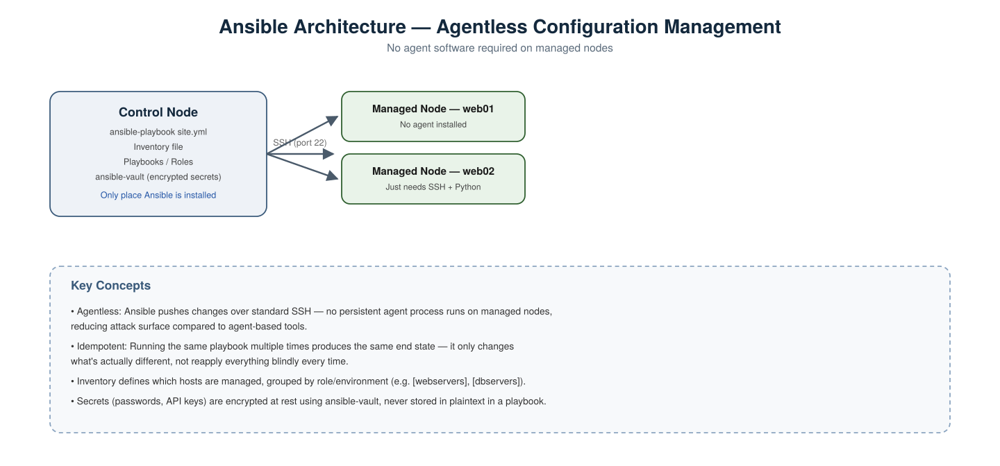
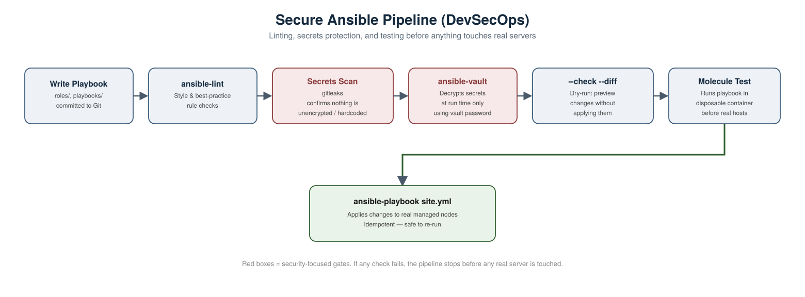

# Ansible Scenario-Based Interview Questions — DevOps &amp; DevSecOps

A collection of real-world, scenario-style Ansible interview questions with detailed answers, covering both general DevOps usage and DevSecOps-specific security concerns.

---

## 1. How does Ansible actually connect to and manage a server? Why is it called "agentless"?



**Scenario:** An interviewer asks you to explain, at a basic level, how Ansible works differently from a tool like an agent-based configuration manager.

**Answer:**
Ansible is **agentless** — it doesn't install or run any persistent background process on the machines it manages. Instead, the **control node** (the machine where you run `ansible-playbook`) connects to each **managed node** over standard **SSH**, pushes the required modules over temporarily, executes them, and then cleans up.

This has real advantages:
- **Smaller attack surface** — no long-running agent process on every server that could itself become a target.
- **Nothing to keep updated** on managed nodes — only SSH access and Python need to be present.
- **Simpler onboarding** — a new server just needs SSH access and an inventory entry, not an agent install step.

---

## 2. You run the same playbook twice in a row. What should happen the second time?

**Scenario:** You apply a playbook that installs Nginx and starts the service. You then run the exact same playbook again five minutes later.

**Answer:** Nothing should change on the second run — this is **idempotency**, one of Ansible's core design principles. Ansible modules check the current state of the system before making changes; if Nginx is already installed and already running, the tasks report `ok` (unchanged) rather than re-running the install or restarting the service.

**Why this matters in an interview:** it demonstrates you understand Ansible playbooks are meant to describe **desired state**, not a literal sequence of one-time commands — and that safely re-running a playbook (e.g. after a partial failure) is expected behavior, not a risk.

```bash
ansible-playbook site.yml
```
```bash
ansible-playbook site.yml
```
Second run output should show `changed=0` for tasks that already succeeded.

---

## 3. How do you store a database password or API key used inside a playbook?

**Scenario:** A playbook needs to configure an application with a database password. Where does that value live?

**Answer:** Never in plaintext in a playbook or `group_vars`/`host_vars` file committed to Git. Use **Ansible Vault** to encrypt the file containing the secret.

Create an encrypted variables file:
```bash
ansible-vault create group_vars/all/vault.yml
```

Edit an existing encrypted file:
```bash
ansible-vault edit group_vars/all/vault.yml
```

Run a playbook that uses vault-encrypted variables, providing the vault password interactively:
```bash
ansible-playbook site.yml --ask-vault-pass
```

Or reference a password file (kept out of Git, ideally sourced from a secrets manager in CI):
```bash
ansible-playbook site.yml --vault-password-file ~/.vault_pass.txt
```

**Good practice to mention:** separate the *variable name* from the *encrypted value* using the common `vault.yml` + `vars.yml` pattern — `vars.yml` references `{{ vault_db_password }}`, while only `vault.yml` is actually encrypted. This lets you safely grep/read variable names without ever decrypting the file.

---

## 4. A colleague accidentally commits an unencrypted `vault.yml` with a real password inside it. What do you do?

**Scenario:** During a PR review, you notice `group_vars/all/vault.yml` was committed as plain YAML instead of being encrypted, and it contains a real production password.

**Answer:**
1. **Rotate the credential immediately** — treat it as compromised the moment it hit Git, regardless of how quickly it's fixed.
2. **Remove it from Git history**, not just in a new commit (`git filter-repo` or similar), since a plain "delete and recommit" leaves it recoverable.
3. **Re-encrypt the corrected file properly:**
```bash
ansible-vault encrypt group_vars/all/vault.yml
```
4. **Add a pre-commit safeguard** going forward — a Gitleaks scan (as covered in earlier sections) or a custom check that fails if a file under `group_vars/`/`host_vars/` matching `vault*.yml` is *not* vault-encrypted (unencrypted vault files start with plain YAML, encrypted ones start with `$ANSIBLE_VAULT;1.1;AES256`).
5. **CI backstop:** run a Gitleaks or custom secrets scan in the pipeline (see the pipeline diagram below) so this is caught automatically even if a local hook is skipped.

---

## 5. How do you safely preview what a playbook *would* change, without actually changing anything?

**Scenario:** Before running a playbook against production, you want to see exactly what it would modify.

**Answer:** Use **check mode** (dry run), combined with `--diff` to see the actual content differences:
```bash
ansible-playbook site.yml --check --diff
```

This runs every task in "what-if" mode — Ansible reports what it *would* change without actually applying it. Note the caveat worth mentioning in an interview: not every module fully supports check mode (some third-party or command-based tasks can't meaningfully predict their outcome), so it's a strong safety net but not a 100% guarantee.

---

## 6. How would you test a playbook before it ever touches a real server?

**Scenario:** You want confidence that a new role works correctly, without risking a shared staging or production environment.

**Answer:** Use **Molecule**, the standard testing framework for Ansible roles. It spins up a disposable container (or VM), runs the role against it, and verifies the result — all in an isolated, throwaway environment.

Initialize a new role with Molecule scaffolding:
```bash
molecule init role my_role --driver-name docker
```

Run the full test sequence (create container → converge → verify → destroy):
```bash
molecule test
```

Run just the playbook against the test container without tearing it down (useful while iterating):
```bash
molecule converge
```

---

## 7. Your playbook fails halfway through on host 3 of 10. What happens to hosts 1–2, and what do you do next?

**Scenario:** A playbook applying configuration across 10 servers fails on the 3rd host due to a task error.

**Answer:**
- By default, Ansible runs **task-by-task across all hosts** (not host-by-host sequentially) — so hosts 1 and 2 will have already completed that same task successfully, and Ansible stops trying to proceed further *on host 3* while continuing normally on hosts 4–10 for that task, unless `any_errors_fatal` is set.
- Ansible automatically creates a **retry file** (`site.retry`, if `retry_files_enabled` is on) listing just the failed hosts.
- Rerun the playbook against only the failed hosts:
```bash
ansible-playbook site.yml --limit @site.retry
```
- Because playbooks are idempotent, it's also generally safe to just rerun the whole playbook — hosts that already succeeded will simply report no changes.

---

## 8. How do you prevent a junior engineer from accidentally running a playbook against production?

**Scenario:** You want strong guardrails so a mistaken `ansible-playbook` command can't reconfigure production servers.

**Answer, layered defense:**
1. **Separate inventory files per environment** (`inventories/dev`, `inventories/staging`, `inventories/prod`), so a mistake in targeting is at least explicit:
```bash
ansible-playbook site.yml -i inventories/staging
```
2. **Require explicit environment confirmation** in CI/CD pipelines (e.g. a manual approval gate before any run targets the `prod` inventory).
3. **Restrict SSH key/credential access** — junior engineers' control node accounts simply don't have working SSH credentials for production hosts at all (least privilege).
4. **Use `--check` by default** in any ad hoc/manual invocation tooling, requiring an explicit flag to actually apply changes.
5. **Tag production runs for extra review** — route all production changes through the pipeline (see diagram below) rather than allowing direct local `ansible-playbook` runs against prod inventory.

---

## 9. Walk me through what a secure, production-ready Ansible CI/CD pipeline looks like.



**Answer, referring to the diagram above:**
1. **Write Playbook** — roles and playbooks are written and pushed to a feature branch.
2. **`ansible-lint`** — catches style issues, deprecated syntax, and common mistakes before anything runs:
```bash
ansible-lint site.yml
```
3. **Secrets Scan** — Gitleaks (or similar) confirms no secrets were accidentally committed unencrypted.
4. **`ansible-vault`** — encrypted secrets are decrypted only at run time, using a vault password sourced securely from the CI system's secret store, never hardcoded in the pipeline config.
5. **`--check --diff`** — a dry run previews exactly what would change, which can be attached to a pull request for human review.
6. **Molecule Test** — the role is tested against a disposable container before it's ever pointed at real infrastructure.
7. **`ansible-playbook site.yml`** — only now does the playbook actually run against real managed nodes, safely and idempotently.

**Why this matters in an interview:** just like a Terraform pipeline, this shows security isn't one bolted-on step — it's distributed checks (linting, secrets scanning, vault-based secret handling, dry-run preview, isolated testing) that each catch a different class of problem before real infrastructure is ever touched.

---

## 10. How do you rotate the Ansible Vault password itself, across many encrypted files?

**Scenario:** Your team's shared vault password needs to be rotated (e.g. someone with access left the team).

**Answer:**
Re-key a single file from an old password to a new one:
```bash
ansible-vault rekey group_vars/all/vault.yml
```

For multiple files at once:
```bash
ansible-vault rekey group_vars/*/vault.yml
```

You'll be prompted for the current password once, then the new password. After rotating, update the password wherever it's stored for CI/CD use (e.g. your secrets manager), and confirm the old password no longer works by testing a decrypt attempt with it.

---

## Summary Table

| # | Scenario | Key Concept Tested |
|---|---|---|
| 1 | How Ansible connects to servers | Agentless architecture, SSH |
| 2 | Running a playbook twice | Idempotency |
| 3 | Storing a secret in a playbook | Ansible Vault |
| 4 | Unencrypted vault file committed | Secrets exposure, rotation, prevention |
| 5 | Previewing changes safely | Check mode / `--diff` |
| 6 | Testing a role before real servers | Molecule |
| 7 | Playbook fails partway through | Retry files, idempotent reruns |
| 8 | Preventing accidental prod runs | Inventory separation, RBAC, approval gates |
| 9 | Full secure pipeline design | End-to-end DevSecOps pipeline |
| 10 | Rotating the vault password | `ansible-vault rekey` |
