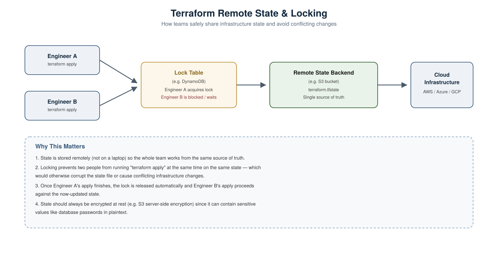
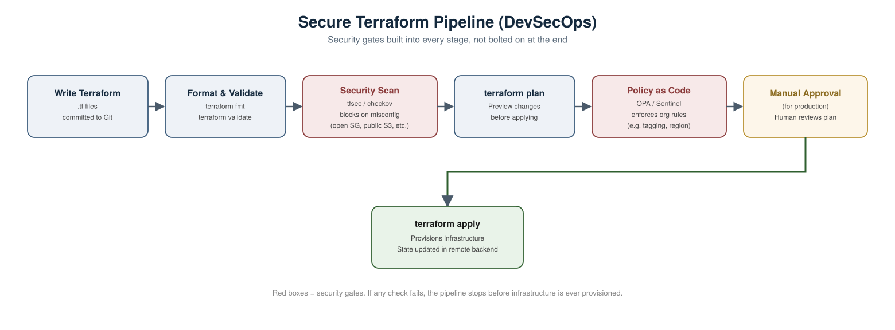

# Terraform Scenario-Based Interview Questions DevOps &amp; DevSecOps

A collection of real-world, scenario-style Terraform interview questions with detailed answers, covering both general DevOps usage and DevSecOps-specific security concerns.

---

## 1. Two engineers run `terraform apply` at the same time. What happens?



**Scenario:** Your team shares a Terraform codebase. Engineer A and Engineer B both run `terraform apply` within seconds of each other against the same environment.

**Answer:**
If the backend supports **state locking** (e.g. S3 + DynamoDB, Terraform Cloud, Azure Storage with native locking), the second `apply` will be blocked with a message like `Error: Error acquiring the state lock`, and Engineer B must wait until Engineer A's run finishes and releases the lock.

If the backend does **not** support locking (e.g. local state file, or a misconfigured remote backend), both applies could run concurrently, leading to a corrupted or inconsistent state file, and potentially conflicting real-world infrastructure changes (e.g. both trying to create the same resource).

**Best practice:** Always use a remote backend with native locking support (S3+DynamoDB, Terraform Cloud/Enterprise, GCS with locking, Azure Storage). Never use local state files for team environments.

---

## 2. Your `terraform.tfstate` file was accidentally committed to a public GitHub repo. What do you do?

**Scenario:** During a security audit, you discover `terraform.tfstate` was committed to your repository months ago, and the repo is public.

**Answer:**
1. **Treat everything in that state file as compromised** state files often contain sensitive values in plaintext (DB passwords, private keys, connection strings), even for resources that look innocuous.
2. **Rotate every credential referenced in the state immediately** don't wait to investigate first.
3. **Remove the file from Git history** (not just delete it going forward) using a tool like `git filter-repo`, since deleting it in a new commit leaves it recoverable in history.
4. **Add `*.tfstate` and `*.tfstate.backup` to `.gitignore`** immediately.
5. **Migrate to a remote backend** (S3, Terraform Cloud, etc.) with encryption at rest and access controls, so state is never a local/committable file again.
6. **Enable state file encryption** at the backend level (e.g. S3 SSE) and restrict IAM access to only those who need it.

---

## 3. A `terraform plan` shows changes you didn't make. What's going on?

**Scenario:** You run `terraform plan` on infrastructure nobody has touched in Terraform recently, and it shows several unexpected changes.

**Answer:** This is **configuration drift** someone (or something) modified the actual infrastructure outside of Terraform, e.g. via the AWS Console, CLI, or another automation tool, and Terraform's state no longer matches reality.

**How to handle it:**
- Run `terraform plan` to see the diff clearly before doing anything.
- Investigate **why** the drift happened was it an emergency manual fix, unauthorized access, or another tool interfering?
- Decide whether to:
  - **Accept the drift** and update Terraform code to match reality, then `terraform apply` to reconcile state, or
  - **Reject the drift** and run `terraform apply` to force infrastructure back to the Terraform-defined state.
- To prevent this going forward, restrict direct console/CLI access to Terraform-managed resources (least privilege / RBAC), and consider running scheduled `terraform plan` drift-detection jobs in CI.

---

## 4. How would you manage secrets (like a database password) needed in your Terraform code?

**Scenario:** A module needs a database password to provision an RDS instance. Where does that value come from?

**Answer:** Never hardcode it in `.tf` files or `terraform.tfvars` committed to Git. Options, from most to least recommended:

1. **Secrets manager integration** pull the value dynamically using a data source:
```hcl
data "aws_secretsmanager_secret_version" "db_password" {
  secret_id = "prod/db/password"
}
```
2. **HashiCorp Vault provider** similar pattern using the Vault Terraform provider to fetch secrets at plan/apply time.
3. **Environment variables** passed via `TF_VAR_` prefix, injected by your CI/CD pipeline from a secrets store, never written to disk:
```bash
export TF_VAR_db_password=$(vault kv get -field=password secret/db)
```
4. Mark the variable `sensitive = true` so it's redacted from CLI output and plan/apply logs:
```hcl
variable "db_password" {
  type      = string
  sensitive = true
}
```

**Important caveat to mention in an interview:** marking a variable `sensitive` hides it from CLI output, but it is still stored in **plaintext in the state file** so backend encryption and access control remain essential regardless.

---

## 5. Your `terraform apply` partially fails halfway through some resources were created, others weren't. What now?

**Scenario:** A network blip or a cloud API error causes `terraform apply` to fail after creating 6 of 10 planned resources.

**Answer:**
- Terraform's state is **updated incrementally as it applies**, not all at once at the end so the 6 successfully created resources are already reflected in the state file.
- Simply **re-run `terraform apply`**. Terraform will compare the current state against the desired state and only attempt to create/modify the remaining resources, not recreate what already succeeded.
- If a resource was left in a broken/partial state (e.g. an EC2 instance that started but never finished configuring), you may need `terraform apply -replace=<resource>` to force Terraform to destroy and recreate that specific resource cleanly.
- In CI/CD, this is why `terraform apply` should generally be **idempotent and safely re-runnable** as a core design principle pipelines shouldn't assume a single successful run is guaranteed.

---

## 6. How do you prevent a junior engineer from accidentally running `terraform destroy` on production?

**Scenario:** You want strong guardrails so a mistaken command can't wipe out a production environment.

**Answer, layered defense:**
1. **Separate state/backends per environment** (dev/staging/prod), so a mistake in one can't touch another.
2. **RBAC on the CI/CD pipeline and cloud provider** junior engineers get read-only or plan-only access to production; only a restricted group can trigger applies/destroys.
3. **Require manual approval gates** in the pipeline before any `apply`/`destroy` runs against production (see the pipeline diagram in question 9).
4. Use `prevent_destroy` lifecycle rules on critical resources:
```hcl
resource "aws_db_instance" "prod" {
  # ...
  lifecycle {
    prevent_destroy = true
  }
}
```
5. **Never run `terraform destroy` manually against prod** route all changes through the pipeline, where the plan is visible and reviewed before anything executes.

---

## 7. How do you manage the same infrastructure code across dev, staging, and production without duplicating it?

**Scenario:** You need three near-identical environments, but don't want three separate copies of your Terraform code to maintain.

**Answer:** Two common approaches:

**A) Terraform Workspaces** — same code, isolated state per workspace:
```bash
terraform workspace new staging
```
```bash
terraform workspace select staging
```
```bash
terraform apply
```
Good for small differences between environments, but state isolation is the *only* thing workspaces give you — variable values still need conditional logic.

**B) Separate directories/modules with shared code (more common in production setups):**
```
environments/
  dev/main.tf
  staging/main.tf
  prod/main.tf
modules/
  network/
  compute/
```
Each environment calls the same shared modules with different variables. This is generally preferred at scale because it keeps state fully isolated, makes environment-specific overrides explicit, and avoids the common pitfall of forgetting which workspace you're currently in before running `apply`.

---

## 8. A security scan flags your Terraform code for an S3 bucket with public read access. How would this get caught before it reaches production?



**Scenario:** A developer accidentally writes:
```hcl
resource "aws_s3_bucket_acl" "example" {
  bucket = aws_s3_bucket.example.id
  acl    = "public-read"
}
```

**Answer:** This is exactly what a **shift-left security gate** in the pipeline is for. Before this ever reaches `terraform apply`:

1. **Static security scanning** with a tool like `tfsec` or `checkov` runs automatically in CI on every pull request:
```bash
tfsec .
```
This would flag the public ACL as a high-severity finding and fail the build.

2. **Policy as Code** (OPA/Conftest or Sentinel) can enforce organization-wide rules, e.g. "no S3 bucket may ever have public-read ACL," as a hard gate that blocks `apply` regardless of what any individual scan catches:
```bash
conftest test plan.json
```

3. Even with both of these, a **human review of the `terraform plan` output** before a production apply is a good final backstop the pipeline should require manual approval for prod changes.

---

## 9. Walk me through what a secure, production-ready Terraform CI/CD pipeline looks like.

**Answer, referring to the diagram above:**
1. **Write Terraform** code is written and pushed to a feature branch.
2. **Format &amp; Validate** `terraform fmt -check` and `terraform validate` catch syntax issues and style violations immediately.
3. **Security Scan** `tfsec`/`checkov` scans the code for misconfigurations (open security groups, public buckets, missing encryption, etc.) and fails the pipeline on high-severity findings.
4. **`terraform plan`** generates a preview of exactly what will change, saved as an artifact for review.
5. **Policy as Code** OPA/Sentinel evaluates the plan against organizational rules (tagging standards, allowed regions, cost thresholds, etc.).
6. **Manual Approval** for production environments specifically, a human reviews the plan output and explicitly approves before anything is applied.
7. **`terraform apply`** only now does infrastructure actually get provisioned, with the remote backend updating state safely (with locking, as covered in question 1).

**Why this matters in an interview:** this shows you understand DevSecOps isn't "add a scanning step" it's security gates distributed across multiple stages, each catching a different class of problem, with human judgment reserved for the highest-stakes step (production apply) rather than the whole process.

---

## 10. How do you handle Terraform state file corruption?

**Scenario:** Your `terraform.tfstate` becomes corrupted or partially unreadable perhaps from an interrupted write or a bad manual edit.

**Answer:**
1. **Check for a backup first** Terraform automatically creates `terraform.tfstate.backup` before most operations that modify state. If using a remote backend like S3 with versioning enabled, previous versions of the state file are also recoverable there.
2. **Restore from the last known-good version:**
```bash
aws s3api get-object --bucket my-tf-state --key prod/terraform.tfstate --version-id <previous-version-id> terraform.tfstate
```
3. **Reconcile any gap** between the restored state and real infrastructure with `terraform plan`, and manually `terraform import` any resources created after that backup was taken but missing from the restored state.
4. **Prevention:** always enable **versioning** on your state storage backend (e.g. S3 bucket versioning) this is the single most effective safeguard against unrecoverable state loss.

---

## Summary Table

| # | Scenario | Key Concept Tested |
|---|---|---|
| 1 | Concurrent applies | Remote state locking |
| 2 | State file leaked publicly | Secrets exposure, state security |
| 3 | Unexpected plan changes | Configuration drift |
| 4 | Secret needed in code | Secrets management, `sensitive` variables |
| 5 | Partial apply failure | State consistency, idempotency |
| 6 | Preventing accidental destroy | RBAC, `prevent_destroy`, approval gates |
| 7 | Multi-environment management | Workspaces vs. directory structure |
| 8 | Insecure resource config | Shift-left scanning, policy as code |
| 9 | Full secure pipeline design | End-to-end DevSecOps pipeline |
| 10 | State file corruption | Backups, state versioning, recovery |
