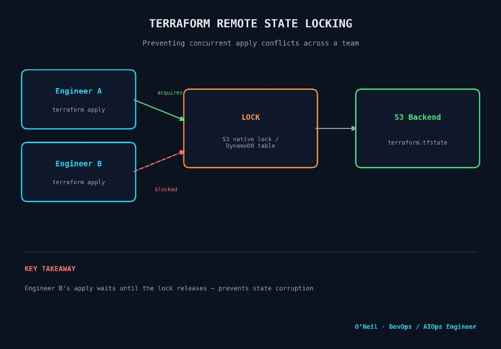
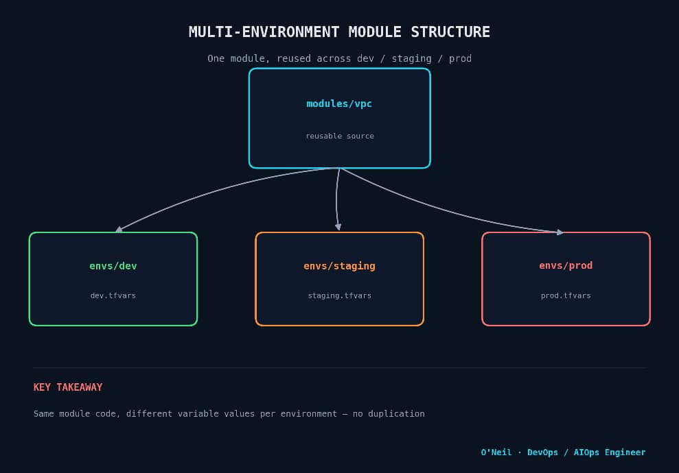

# Terraform Scenario-Based Interview Questions & Answers

A practical, scenario-driven Terraform interview prep guide for experienced DevOps/Infra engineers covering state management, module design, drift, secrets, imports, and disaster recovery. Each question reflects a real production situation rather than pure syntax trivia.

---

## Table of Contents

1. [State Locking & Team Conflicts](#1-state-locking--team-conflicts)
2. [Multi-Environment Module Reuse](#2-multi-environment-module-reuse)
3. [State File Corruption / Loss](#3-state-file-corruption--loss)
4. [Handling Configuration Drift](#4-handling-configuration-drift)
5. [Importing Existing Infrastructure](#5-importing-existing-infrastructure)
6. [Managing Secrets Safely](#6-managing-secrets-safely)
7. [count vs for_each](#7-count-vs-for_each)
8. [Provider Version Pinning](#8-provider-version-pinning)
9. [Refactoring Without Destroying Resources](#9-refactoring-without-destroying-resources)
10. [Workspaces vs Directory-per-Environment](#10-workspaces-vs-directory-per-environment)

---

## 1. State Locking & Team Conflicts

**Scenario:** Two engineers run `terraform apply` on the same workspace at the same time. What happens, and how do you prevent state corruption?

**Answer:**
Terraform uses a **locking mechanism** on the backend to serialize writes to the state file. With an S3 backend + DynamoDB (or S3's native locking in Terraform 1.11+), the second `apply` is blocked until the first one releases the lock — it doesn't silently overwrite state.



```hcl
terraform {
  backend "s3" {
    bucket         = "company-tfstate"
    key            = "prod/network/terraform.tfstate"
    region         = "us-east-1"
    dynamodb_table = "tf-lock-table"   # not needed if using S3 native locking (1.11+)
    encrypt        = true
  }
}
```

If a lock gets stuck (e.g., a CI job was killed mid-apply), you can manually release it:

```bash
terraform force-unlock <LOCK_ID>
```

> **Interview tip:** Mention that `force-unlock` should only be used after confirming no other apply is actually in progress forcing it while a real apply is running is how state corruption happens.

---

## 2. Multi-Environment Module Reuse

**Scenario:** You need the same VPC setup in dev, staging, and prod, but with different CIDR ranges and instance sizes. How do you avoid duplicating code three times?

**Answer:**
Build a single reusable **module**, and drive environment differences through variables not copy-pasted `.tf` files.



```
modules/
  vpc/
    main.tf
    variables.tf
    outputs.tf
envs/
  dev/
    main.tf        # calls module with dev.tfvars
    dev.tfvars
  staging/
    main.tf
    staging.tfvars
  prod/
    main.tf
    prod.tfvars
```

```hcl
# envs/prod/main.tf
module "vpc" {
  source   = "../../modules/vpc"
  cidr     = var.cidr
  az_count = var.az_count
}
```

```hcl
# envs/prod/prod.tfvars
cidr     = "10.0.0.0/16"
az_count = 3
```

Each environment gets its **own state file** (separate backend key), so a mistake in dev can never touch prod state.

---

## 3. State File Corruption / Loss

**Scenario:** Your S3 state file bucket had an accidental object overwrite and the current state is corrupted. Infrastructure is still running fine. How do you recover without downtime?

**Answer:**
1. **Don't panic-apply.** The real infrastructure is untouched only Terraform's record of it is broken.
2. Restore from **S3 versioning** if enabled (this is why versioning on the state bucket is non-negotiable):
   ```bash
   aws s3api list-object-versions --bucket company-tfstate --prefix prod/network/terraform.tfstate
   aws s3api get-object --bucket company-tfstate --key prod/network/terraform.tfstate --version-id <ID> restored.tfstate
   ```
3. If no backup exists, rebuild state using `terraform import` for each resource against real infrastructure IDs.
4. Run `terraform plan` immediately after recovery — a clean plan (no unexpected diff) confirms state now matches reality.

> **Interview tip:** This question is really testing whether you enable **state bucket versioning and encryption by default** say so explicitly, it's the preventive answer they're listening for.

---

## 4. Handling Configuration Drift

**Scenario:** Someone manually changed a security group rule in the AWS console. `terraform plan` now shows a diff. How do you handle it?

**Answer:**
Two options depending on intent:

**A. The manual change was a mistake** let Terraform revert it:
```bash
terraform apply
```

**B. The manual change should be kept** update the `.tf` code to match reality, then reconcile state:
```bash
terraform apply -refresh-only
```

```hcl
resource "aws_security_group_rule" "allow_https" {
  type        = "ingress"
  from_port   = 443
  to_port     = 443
  protocol    = "tcp"
  cidr_blocks = ["0.0.0.0/0"]   # updated to match the manual change
  security_group_id = aws_security_group.web.id
}
```

Longer term: restrict console write access via IAM policy so drift like this can't happen outside Terraform.

---

## 5. Importing Existing Infrastructure

**Scenario:** A production S3 bucket was created manually years ago and now needs to be managed by Terraform without recreating it. Walk through the process.

**Answer:**
```hcl
resource "aws_s3_bucket" "legacy_logs" {
  bucket = "company-legacy-logs"
}
```

```bash
terraform import aws_s3_bucket.legacy_logs company-legacy-logs
terraform plan
```

The `plan` will likely show a diff — Terraform only imports the resource ID, not its full config. You then adjust the `.tf` resource block attribute-by-attribute until `plan` shows **no changes**, confirming code and real state match.

> Terraform 1.5+ also supports declarative import blocks:
> ```hcl
> import {
>   to = aws_s3_bucket.legacy_logs
>   id = "company-legacy-logs"
> }
> ```

---

## 6. Managing Secrets Safely

**Scenario:** A module needs a database password. How do you avoid it ending up in plaintext in the state file or git history?

**Answer:**
- **Never hardcode secrets** in `.tf` files or `.tfvars` committed to git.
- Pull secrets at apply-time from a secrets manager:

```hcl
data "aws_secretsmanager_secret_version" "db_password" {
  secret_id = "prod/db/password"
}

resource "aws_db_instance" "main" {
  password = data.aws_secretsmanager_secret_version.db_password.secret_string
}
```

- Mark sensitive outputs/variables so they're redacted in CLI output:
```hcl
variable "db_password" {
  type      = string
  sensitive = true
}
```

- Note: `sensitive = true` hides values from CLI output but **does not encrypt them in the state file** state itself must be encrypted at rest (S3 `encrypt = true` + KMS).

---

## 7. count vs for_each

**Scenario:** You need to create IAM users for a list of 5 team members. Later, one person leaves and is removed from the middle of the list. What breaks if you use `count`, and how does `for_each` fix it?

**Answer:**
With `count`, resources are indexed numerically (`0, 1, 2...`). Removing an item from the middle of the list shifts every subsequent index — Terraform sees this as destroying and recreating resources it shouldn't touch.

```hcl
# Fragile
resource "aws_iam_user" "team" {
  count = length(var.usernames)
  name  = var.usernames[count.index]
}
```

`for_each` keys resources by a stable string, so removing one item only affects that one resource:

```hcl
# Stable
resource "aws_iam_user" "team" {
  for_each = toset(var.usernames)
  name     = each.value
}
```

---

## 8. Provider Version Pinning

**Scenario:** A pipeline that worked yesterday suddenly fails after a provider auto-updated and introduced a breaking change. How do you prevent this?

**Answer:**
Pin provider versions explicitly and commit the lock file:

```hcl
terraform {
  required_providers {
    aws = {
      source  = "hashicorp/aws"
      version = "~> 5.40"
    }
  }
}
```
>generates .terraform.lock.hcl
```bash
terraform init
```
>commit it — this is what makes builds reproducible
```bash
git add .terraform.lock.hcl
```

The lock file guarantees every teammate and every CI run resolves to the exact same provider version until someone deliberately runs `terraform init -upgrade`.

---

## 9. Refactoring Without Destroying Resources

**Scenario:** You're renaming a resource block from `aws_instance.web` to `aws_instance.web_server` for clarity. A naive apply would destroy and recreate the instance. How do you rename safely?

**Answer:**
Use a `moved` block (Terraform 1.1+) to tell Terraform the resource was renamed, not replaced:

```hcl
moved {
  from = aws_instance.web
  to   = aws_instance.web_server
}
```

Run `terraform plan` it should show **0 to add, 0 to destroy**, confirming Terraform mapped the existing resource to its new address in state without touching real infrastructure.

---

## 10. Workspaces vs Directory-per-Environment

**Scenario:** Your team is debating Terraform workspaces vs separate directories per environment (dev/staging/prod). What's the tradeoff, and which would you recommend for a team of 10 engineers managing prod-critical infra?

**Answer:**

| | **Workspaces** | **Directory per environment** |
|---|---|---|
| State isolation | Same backend, different state per workspace | Fully separate backend/state per env |
| Risk of wrong-env apply | Higher easy to forget `terraform workspace select` | Lower path itself forces intent |
| Variable differences | Harder to manage cleanly | Natural fit one `.tfvars` per dir |
| Best for | Small teams, ephemeral/ short-lived environments (feature branches) | Teams managing prod-critical, long-lived infra |

**Recommendation:** For a 10-engineer team managing production-critical infrastructure, directory-per-environment is safer the explicit path (`envs/prod/`) makes it much harder to accidentally apply against production, and access controls (IAM/CI permissions) can be scoped per directory.

---

## Notes for the Interview

- Always tie your answer back to **why it matters in production** (blast radius, team safety, auditability) not just "how the command works."
- If asked to whiteboard, sketch the state file / backend / lock relationship first most Terraform incidents trace back to state management, not resource syntax.

---

*O'Neil Kimbi · DevSecOps / AIOps Engineer*
