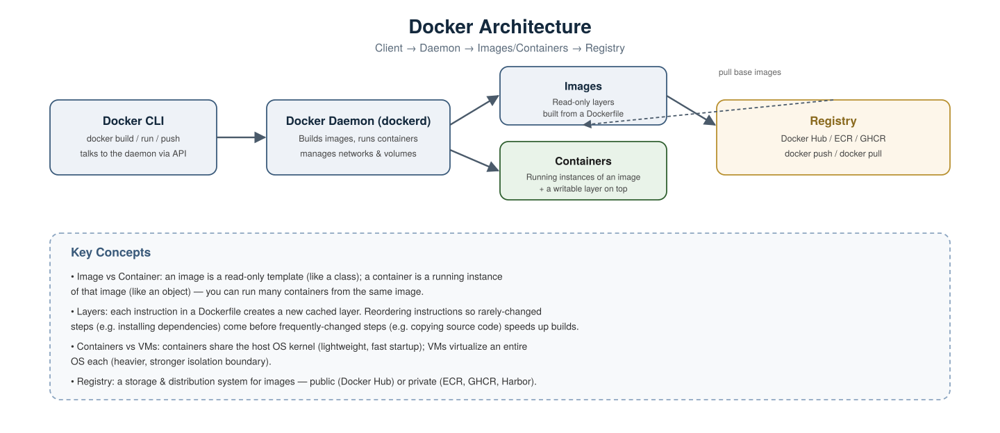
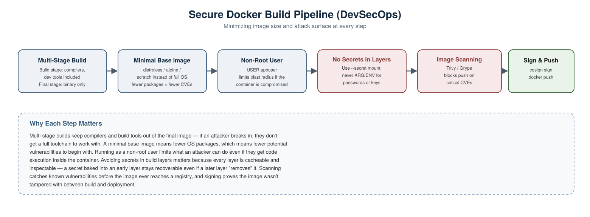

# Docker Scenario-Based Interview Questions — DevOps & DevSecOps

A collection of real-world, scenario-style Docker interview questions with detailed answers, covering both general DevOps usage and DevSecOps-specific security concerns.

---

## 1. What's the actual difference between an image and a container, and how do they relate to the daemon and registry?



**Scenario:** An interviewer asks you to explain Docker's architecture from the ground up, not just "how to use" it.

**Answer:**
- The **Docker CLI** is what you type commands into (`docker build`, `docker run`); it talks to the **Docker daemon (`dockerd`)** over an API, not directly to containers.
- The **daemon** does the actual work — building images, running containers, managing networks and volumes.
- An **image** is a read-only template made of stacked layers, built from a Dockerfile.
- A **container** is a running instance of an image, with a thin writable layer added on top. You can run many containers from the same image.
- A **registry** (Docker Hub, ECR, GHCR, Harbor) is where built images are stored and distributed via `docker push`/`docker pull`.

**Follow-up worth mentioning:** containers share the host's OS kernel, which is why they start in milliseconds and are lightweight — unlike a VM, which virtualizes an entire OS and is comparatively heavy.

---

## 2. Your Docker image build takes 10 minutes even for a one-line code change. How do you speed it up?

**Scenario:** Every time a developer changes one line of application code, the full `docker build` reinstalls all dependencies from scratch.

**Answer:** This is almost always a **layer caching / instruction ordering** problem. Docker caches each instruction as a layer, and reuses cached layers as long as nothing above them changed. If dependency installation is placed *after* copying all source code, any code change invalidates the cache for everything below it too.

**Bad ordering:**
```dockerfile
COPY . .
RUN go mod download
RUN go build -o app
```

**Better ordering — copy dependency manifests first, install, then copy the rest:**
```dockerfile
COPY go.mod go.sum ./
RUN go mod download
COPY . .
RUN go build -o app
```

Now, unless `go.mod`/`go.sum` change, the dependency download layer stays cached, and only the final build step reruns on a code change.

---

## 3. A container you built runs as root by default. Why is that a problem, and how do you fix it?

**Scenario:** A security review flags that your application's container is running as `root` inside the container.

**Answer:** If an attacker manages to exploit a vulnerability in the application and achieve code execution inside the container, running as root means they have full privileges *within that container* — and depending on how the container is configured (e.g. certain mounted volumes, `--privileged` mode, kernel vulnerabilities), that can sometimes be escalated toward the host itself. Least privilege applies to containers just as much as servers.

**Fix — create and switch to a non-root user in the Dockerfile:**
```dockerfile
RUN addgroup --system appgroup && adduser --system --ingroup appgroup appuser
USER appuser
```

Verify at runtime:
```bash
docker run --rm myimage whoami
```
Expected output: `appuser`, not `root`.

---

## 4. How do you keep build tools (compilers, package managers) out of your final production image?



**Scenario:** Your Go application's final image is 900MB because it includes the entire Go toolchain, even though the app itself is a single compiled binary.

**Answer:** Use a **multi-stage build** — one stage compiles the application with all necessary build tools, and only the compiled artifact is copied into a clean, minimal final image.

```dockerfile
# Build stage — has compilers, full toolchain
FROM golang:1.23 AS build
WORKDIR /app
COPY . .
RUN go build -o main .

# Final stage — minimal, no build tools at all
FROM gcr.io/distroless/base
COPY --from=build /app/main .
CMD ["./main"]
```

**Why this matters for security, not just size:** if an attacker gets code execution in the final container, there's no compiler, package manager, or shell available to help them do anything further — the attack surface is dramatically smaller than a full OS image with build tools still present.

---

## 5. A developer passes a secret using `--build-arg` in the Dockerfile. Why is this a security problem?

**Scenario:** You see this in a Dockerfile:
```dockerfile
ARG DB_PASSWORD
RUN echo $DB_PASSWORD > /app/config
```

**Answer:** Build args and intermediate layers are **cached and inspectable** — even if a later step deletes the file, the value is still recoverable from the image history:
```bash
docker history myimage --no-trunc
```
This would reveal the secret in plaintext, since Docker layers are additive — deleting a file in a later layer doesn't erase it from the earlier layer where it was written.

**Fix — use BuildKit's secret mount feature**, which makes the secret available only during the specific build step, and never persists it in any layer:
```dockerfile
# syntax=docker/dockerfile:1
RUN --mount=type=secret,id=db_password \
    DB_PASSWORD=$(cat /run/secrets/db_password) && echo "using secret securely"
```

Build with the secret supplied at build time only:
```bash
docker build --secret id=db_password,src=./db_password.txt .
```

---

## 6. How do you catch known vulnerabilities in your image before it's pushed to a registry?

**Scenario:** You want an automated gate that blocks a Docker image from being published if it contains high-severity vulnerabilities.

**Answer:** Add a **container image scanning** step to your pipeline using a tool like Trivy.

Build the image:
```bash
docker build -t myapp:latest .
```

Scan it:
```bash
trivy image myapp:latest
```

Fail the pipeline specifically on critical vulnerabilities, so low-severity noise doesn't block every build:
```bash
trivy image --severity CRITICAL --exit-code 1 myapp:latest
```

This should run automatically in CI, right after the build step and before `docker push`, so a vulnerable image never reaches the registry in the first place.

---

## 7. What's wrong with running a container using `--privileged`, and when (if ever) is it justified?

**Scenario:** A teammate suggests running a container with `--privileged` to "just make a permissions error go away."

**Answer:** `--privileged` disables nearly all of Docker's container isolation — the container gets access to all host devices and capabilities, effectively similar to root access on the host itself. If that container is compromised, the attacker potentially has a much easier path to the underlying host, not just the container.

**Almost always, the real fix is more targeted** — grant only the specific Linux capability actually needed, instead of everything:
```bash
docker run --cap-add=NET_ADMIN myimage
```

**Legitimate rare use cases** for `--privileged` include certain low-level system tools (e.g. Docker-in-Docker setups, certain hardware access scenarios) — but even then, it should be scoped as narrowly and temporarily as possible, and never used as a default fix for a permissions error.

---

## 8. Two containers need to talk to each other. How do you set that up securely?

**Scenario:** Your app container needs to reach a database container, without exposing the database to the outside world.

**Answer:** Create a **user-defined bridge network** and attach both containers to it — this gives them DNS-based service discovery by container name, and keeps them isolated from other unrelated containers.

Create the network:
```bash
docker network create app-network
```

Run the database container on it, without publishing its port externally:
```bash
docker run -d --name db --network app-network postgres:16
```

Run the app container on the same network — it can reach the database using the hostname `db`:
```bash
docker run -d --name app --network app-network -e DB_HOST=db myapp:latest
```

**Security note worth mentioning:** because the database container's port isn't published with `-p`, it's unreachable from outside the Docker host entirely — only containers on the same user-defined network can reach it.

---

## 9. Where should persistent data (like a database's files) actually live, and why does it matter?

**Scenario:** A container running a database is restarted, and all the data disappears.

**Answer:** Anything written inside a container's writable layer is **lost when the container is removed** — containers are meant to be disposable and stateless by design. Persistent data must live in a **volume**, which exists independently of any single container's lifecycle.

Create and use a named volume:
```bash
docker volume create db-data
```
```bash
docker run -d --name db -v db-data:/var/lib/postgresql/data postgres:16
```

Now the container can be stopped, removed, and recreated, and the data in `db-data` persists across all of it.

**Security angle:** volumes should also be backed up and access-controlled like any other data store — a volume containing a database isn't automatically encrypted or access-restricted just because it's a Docker construct.

---

## 10. Walk me through what a secure Docker build pipeline looks like end-to-end.

**Answer, referring to the pipeline diagram above:**
1. **Multi-Stage Build** — compile with full tooling in one stage, ship only the final artifact in a clean stage.
2. **Minimal Base Image** — use `distroless`, `alpine`, or `scratch` instead of a full OS image, reducing the number of packages (and therefore known CVEs) present at all.
3. **Non-Root User** — the container process runs as an unprivileged user, limiting the impact of any compromise.
4. **No Secrets in Layers** — secrets are injected via BuildKit's `--secret` mount or at runtime, never baked into a cached layer via `ARG`/`ENV`.
5. **Image Scanning** — Trivy/Grype scans the built image and blocks the pipeline on critical vulnerabilities before it's ever pushed.
6. **Sign & Push** — the image is cryptographically signed (e.g. with `cosign`) so downstream systems can verify it hasn't been tampered with, then pushed to the registry.

**Why this matters in an interview:** it shows the same DevSecOps theme as the Terraform/Ansible pipelines — security isn't one scanning step bolted on at the end, it's a series of deliberate choices (build structure, base image, user privileges, secret handling) plus automated verification, each addressing a different risk.

---

## Summary Table

| # | Scenario | Key Concept Tested |
|---|---|---|
| 1 | Explaining Docker's architecture | Client/daemon/image/container/registry |
| 2 | Slow rebuilds on small changes | Layer caching, instruction ordering |
| 3 | Container running as root | Least privilege, `USER` instruction |
| 4 | Bloated final image | Multi-stage builds |
| 5 | Secret passed via `--build-arg` | Layer inspectability, BuildKit `--secret` |
| 6 | Catching known CVEs before push | Image scanning (Trivy) |
| 7 | Container running `--privileged` | Capability scoping, isolation risk |
| 8 | Containers needing to communicate | User-defined networks, service discovery |
| 9 | Data lost on container restart | Volumes, stateless container design |
| 10 | Full secure pipeline design | End-to-end DevSecOps build pipeline |
