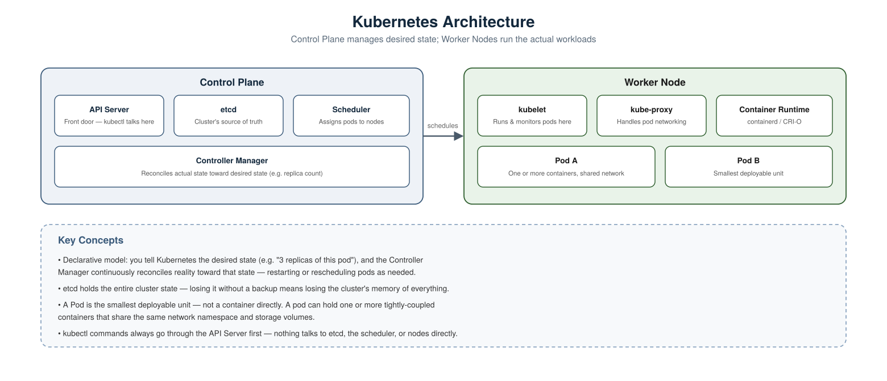
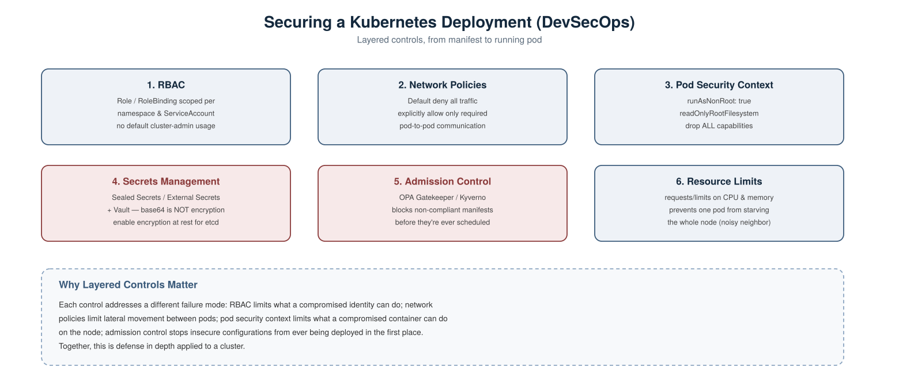

# Kubernetes Scenario-Based Interview Questions — DevOps & DevSecOps

A collection of real-world, scenario-style Kubernetes interview questions with detailed answers, covering both general DevOps operations and DevSecOps-specific security concerns.

---

## 1. Walk me through what happens, component by component, when you run `kubectl apply -f deployment.yaml`.



**Scenario:** An interviewer wants to confirm you understand the cluster's internals, not just the CLI commands.

**Answer:**
1. `kubectl` sends the request to the **API Server** — the only component anything talks to directly; nothing accesses etcd, the scheduler, or nodes directly.
2. The API Server validates the request and writes the desired state into **etcd**, the cluster's key-value store and single source of truth.
3. The **Controller Manager** notices a new Deployment exists and creates the corresponding ReplicaSet/Pod objects to match the desired replica count.
4. The **Scheduler** picks a suitable **Worker Node** for each unscheduled pod, based on resource availability and constraints.
5. On that node, the **kubelet** picks up the assignment and instructs the **container runtime** (containerd/CRI-O) to actually pull the image and start the container(s).
6. **kube-proxy** on each node updates networking rules so the pod is reachable as expected via Services.

**Key concept to mention:** this is a **declarative, reconciliation-based model** — you declare desired state, and the Controller Manager continuously works to make reality match it, rather than executing a one-time imperative script.

---

## 2. A pod is stuck in `CrashLoopBackOff`. How do you troubleshoot it?

**Scenario:** `kubectl get pods` shows a pod repeatedly restarting.

**Answer, step by step:**

Check the pod's recent events and status first:
```bash
kubectl describe pod <pod-name>
```

Check the container's logs from its most recent (crashed) run:
```bash
kubectl logs <pod-name> --previous
```

Common causes to check for, based on what the logs show:
- **Application error on startup** (missing env var, bad config) — fix the underlying app/config issue.
- **Failing readiness/liveness probe** killing the container repeatedly — check the probe configuration itself, not just the app.
- **Resource limits too low**, causing an OOMKill — check for `OOMKilled` in the describe output:
```bash
kubectl describe pod <pod-name> | grep -A 3 "Last State"
```

If it's an OOMKill, increase the memory limit in the manifest and reapply:
```bash
kubectl apply -f deployment.yaml
```

---

## 3. Are Kubernetes Secrets actually secure? What's the catch, and how do you fix it?

**Scenario:** A teammate says "we store our passwords in Kubernetes Secrets, so we're fine."

**Answer:** By default, **Kubernetes Secrets are only base64-encoded, not encrypted** — base64 is trivially reversible, not a security control:
```bash
kubectl get secret db-secret -o jsonpath='{.data.password}' | base64 -d
```
Anyone with read access to Secrets in that namespace (or access to the underlying etcd data, if it's not encrypted at rest) can read them in plaintext.

**Real fixes:**
1. **Enable encryption at rest for etcd**, so Secrets are actually encrypted where they're stored:
```bash
--encryption-provider-config=/etc/kubernetes/encryption-config.yaml
```
2. **Use a dedicated secrets manager** integrated via a tool like **External Secrets Operator** or **Sealed Secrets**, so real values never live directly as plain Kubernetes Secret objects committed to Git.
3. **Restrict RBAC** so only specific ServiceAccounts/roles can read Secrets in a namespace — not every pod or user by default.

---

## 4. A compromised application pod is able to create and delete other resources in the cluster. What's misconfigured?



**Scenario:** During an incident, you discover the compromised pod's ServiceAccount had permissions far beyond what the app actually needed.

**Answer:** This is a classic **RBAC over-permissioning** problem — likely the pod was using the `default` ServiceAccount with a broad ClusterRole bound to it, or a custom ServiceAccount was granted `cluster-admin` "just to make things work."

**Fix — create a minimally-scoped Role and bind it to a dedicated ServiceAccount:**
```yaml
apiVersion: rbac.authorization.k8s.io/v1
kind: Role
metadata:
  namespace: my-app
  name: pod-reader
rules:
- apiGroups: [""]
  resources: ["pods"]
  verbs: ["get", "list"]
```

Bind it to a specific ServiceAccount, not the default one:
```yaml
apiVersion: rbac.authorization.k8s.io/v1
kind: RoleBinding
metadata:
  name: pod-reader-binding
  namespace: my-app
subjects:
- kind: ServiceAccount
  name: my-app-sa
  namespace: my-app
roleRef:
  kind: Role
  name: pod-reader
  apiGroup: rbac.authorization.k8s.io
```

Reference the dedicated ServiceAccount in the pod spec:
```yaml
spec:
  serviceAccountName: my-app-sa
```

**Interview tip:** mention that RBAC should be scoped per-namespace with `Role`/`RoleBinding` wherever possible, reserving cluster-wide `ClusterRole`/`ClusterRoleBinding` only for things that genuinely need cluster scope.

---

## 5. By default, can any pod in your cluster talk to any other pod? Is that a problem?

**Scenario:** You're asked to review network security for a multi-tenant cluster running several unrelated applications.

**Answer:** Yes — by default, Kubernetes allows **all pods to communicate with all other pods**, with no restrictions, unless NetworkPolicies say otherwise. In a multi-tenant or security-sensitive cluster, this means a compromised pod in one application could freely reach a completely unrelated database pod in another namespace.

**Fix — apply a default-deny NetworkPolicy per namespace, then explicitly allow only what's needed:**

Deny all ingress traffic by default:
```yaml
apiVersion: networking.k8s.io/v1
kind: NetworkPolicy
metadata:
  name: default-deny
  namespace: my-app
spec:
  podSelector: {}
  policyTypes:
  - Ingress
```

Then explicitly allow only the frontend to reach the backend:
```yaml
apiVersion: networking.k8s.io/v1
kind: NetworkPolicy
metadata:
  name: allow-frontend-to-backend
  namespace: my-app
spec:
  podSelector:
    matchLabels:
      app: backend
  ingress:
  - from:
    - podSelector:
        matchLabels:
          app: frontend
```

**Caveat to mention:** NetworkPolicies only take effect if your CNI plugin actually supports them (e.g. Calico, Cilium) — some basic CNIs silently ignore them entirely.

---

## 6. A container is compromised and the attacker tries to write a malicious binary to disk or escalate privileges. How do pod-level settings limit this?

**Scenario:** Even with network and RBAC controls in place, you want the pod itself to be hardened against what a compromised container can do.

**Answer:** Use a **securityContext** to restrict the container's capabilities at the pod/container level:

```yaml
spec:
  containers:
  - name: app
    image: myapp:latest
    securityContext:
      runAsNonRoot: true
      readOnlyRootFilesystem: true
      allowPrivilegeEscalation: false
      capabilities:
        drop:
        - ALL
```

- `runAsNonRoot: true` — refuses to start the container if it tries to run as root.
- `readOnlyRootFilesystem: true` — the attacker can't write a malicious binary to the container's filesystem at all.
- `allowPrivilegeEscalation: false` — blocks techniques like setuid binaries from gaining more privilege than the process started with.
- `capabilities: drop: [ALL]` — removes all Linux capabilities by default; only add back the specific ones actually needed (e.g. `NET_BIND_SERVICE`).

---

## 7. How do you stop a single misbehaving pod from consuming all the CPU/memory on a node and affecting other workloads?

**Scenario:** One application's pod has a memory leak and is starving other pods on the same node.

**Answer:** Set explicit **resource requests and limits** on every container:

```yaml
resources:
  requests:
    cpu: "250m"
    memory: "256Mi"
  limits:
    cpu: "500m"
    memory: "512Mi"
```

- **Requests** tell the scheduler how much to reserve for this pod when deciding placement.
- **Limits** cap what the container can actually use — exceeding the memory limit gets the container OOMKilled (protecting the node), and exceeding the CPU limit gets it throttled rather than allowed to starve neighbors.

**Cluster-wide backstop:** set a `LimitRange` and `ResourceQuota` per namespace, so pods without explicit limits still get sane defaults rather than being unbounded by omission.

---

## 8. How do you make sure only compliant, secure Kubernetes manifests can be deployed to your cluster in the first place?

**Scenario:** Despite good manifests existing as examples, a developer occasionally applies one with `privileged: true` or no resource limits.

**Answer:** Use an **admission controller** like **OPA Gatekeeper** or **Kyverno** to enforce policy at the cluster level — rejecting non-compliant manifests before they're ever scheduled, regardless of who applies them or how.

Example Kyverno policy blocking privileged containers cluster-wide:
```yaml
apiVersion: kyverno.io/v1
kind: ClusterPolicy
metadata:
  name: disallow-privileged
spec:
  validationFailureAction: Enforce
  rules:
  - name: no-privileged-containers
    match:
      resources:
        kinds:
        - Pod
    validate:
      message: "Privileged containers are not allowed."
      pattern:
        spec:
          containers:
          - securityContext:
              privileged: "false"
```

**Why this matters in an interview:** this is the Kubernetes equivalent of Policy as Code in a Terraform pipeline — it converts a written security standard into an automatically enforced, unbypassable rule.

---

## 9. How do you roll out a new version of an application with zero downtime, and safely roll back if it's broken?

**Scenario:** You need to deploy a new image version to a production Deployment without an outage, and want a safety net if something's wrong.

**Answer:**
Update the image, triggering Kubernetes' default **RollingUpdate** strategy:
```bash
kubectl set image deployment/myapp myapp=myapp:v2
```

Watch the rollout progress:
```bash
kubectl rollout status deployment/myapp
```

**Critical piece often missed:** a `readinessProbe` must be configured so Kubernetes actually knows when a new pod is ready to receive traffic — without it, the rolling update can route traffic to pods that aren't actually ready yet:
```yaml
readinessProbe:
  httpGet:
    path: /healthz
    port: 8080
  initialDelaySeconds: 5
  periodSeconds: 10
```

If the new version is broken, roll back instantly to the previous revision:
```bash
kubectl rollout undo deployment/myapp
```

---

## 10. Walk me through what a secure Kubernetes deployment looks like, end to end.

**Answer, referring to the security diagram above:**
1. **RBAC** — every workload uses a dedicated ServiceAccount with a narrowly-scoped Role, never `cluster-admin` or the `default` ServiceAccount.
2. **Network Policies** — default deny all traffic per namespace, with explicit allow rules only for required communication paths.
3. **Pod Security Context** — containers run as non-root, with a read-only root filesystem and all Linux capabilities dropped by default.
4. **Secrets Management** — real secrets come from a proper secrets manager (Vault, External Secrets, Sealed Secrets) with etcd encryption at rest enabled, not plain base64 Secrets.
5. **Admission Control** — OPA Gatekeeper/Kyverno enforces these standards automatically, rejecting any manifest that doesn't comply, regardless of who applies it.
6. **Resource Limits** — every container has explicit CPU/memory requests and limits, so one workload can't starve the node.

**Why this matters in an interview:** exactly like the Terraform, Ansible, Docker, and Linux answers — this shows defense in depth: no single control is relied upon alone, and each addresses a distinct failure mode (identity, network, host, data, policy, and availability).

---

## Summary Table

| # | Scenario | Key Concept Tested |
|---|---|---|
| 1 | Explaining what happens on `kubectl apply` | Control plane architecture, reconciliation |
| 2 | Pod stuck in CrashLoopBackOff | Troubleshooting workflow, logs, OOMKill |
| 3 | "Are Secrets secure by default?" | Base64 vs encryption, etcd encryption, secrets managers |
| 4 | Compromised pod with excess permissions | RBAC least privilege, Role/RoleBinding |
| 5 | Any pod can reach any pod | NetworkPolicies, default deny |
| 6 | Limiting what a compromised container can do | securityContext, capabilities, read-only FS |
| 7 | One pod starving node resources | Resource requests/limits, LimitRange |
| 8 | Preventing insecure manifests from deploying | Admission controllers, policy as code |
| 9 | Zero-downtime deployment with rollback | RollingUpdate, readiness probes, rollout undo |
| 10 | Full secure deployment design | Defense in depth for Kubernetes |
